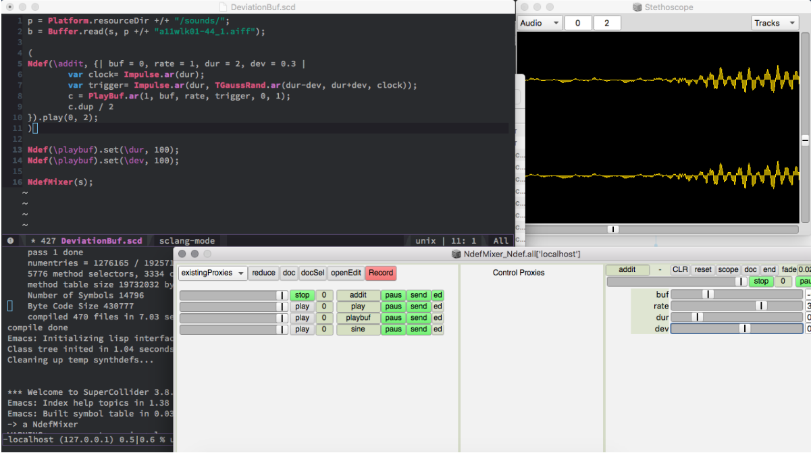
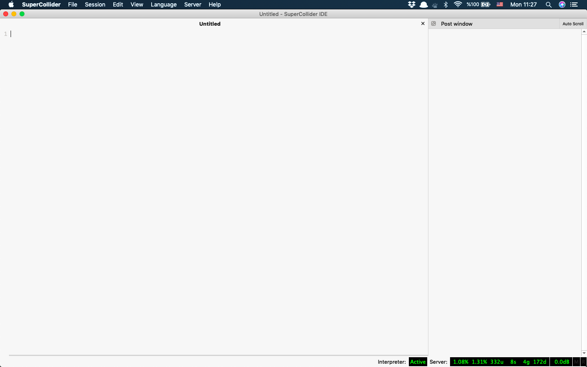

# An Introduction to SuperCollider



Programming audio applications and interactive sound synthesis software,
using the SuperCollider programming language.

Programming looks propably not like this but similarly takes much
handgrafted detail to make something functional and useful for creative
applications.

Once it's done, there are some very fine details that provide efficiency
to the overall structure, sometimes hard to be seen but making the
finished program operate smoothly.

## Introduction to SuperCollider
SuperCollider (SC) (https://supercollider.github.io/) is a programming
language for audio synthesis; it provides a state of the art server to
create sound and a programming language to interact and evaluate code,
as well as a fully functional IDE and help browser. SC is oriented for
sound synthesis and algorithmic composition providing a series of ready
made classes to manipulate and create real time sound on the computer.

Creating sound with SC can be very rewarding using its ready made unit
generators to build novel instruments and sound generators. Firstly,
let's take a look on the IDE of the SuperCollider.  

### Resources
If you haven't already downloaded the language so far, do so now from
this link: https://supercollider.github.io/  

## The IDE

Take a tour on the Menu of SC and try to save some files as you would
save anything in your operation system. Try to memorize the keyboard
shortcuts working in SC.

### Post Window
Once you start SC most likely, you will see a blank page, and some text
printed on the side of the window inside the IDE. In the SC ecosystem,
this is what is called the Post Window. This provides important
information about several things while working, including:

+ Classes included in your SC installation.
+ Audio information
  + such as sample rate
  + audio interfaces connected
  + ins and outs of these
  + and some optimistic messages.

Assuming there is no problem with your installation shown in the post
window, you are ready to start coding.

### Help
There is a plethora of tutorials and help files in the native help file
system of SC. Reached from the IDE you may search and learn specific and
general topics covered inside the provided files.

## Server and language
SC is two applications, specifically is three, but what is important now
is to understand that when working in SC we actually interact with the
synthesis engine, named Server, it is responsible to create the sound
for us by taking orders by the language, hence the Server. The orders we
give are interpreted in some language that the Server understands, but
we not. The language we write is translated by the interpreter once we
evaluate or execute a line of code.

### Code execution
Try to do some mathematical calculations in SC and see what happens. For
testing run this on top of your blank page in the IDE.  
````
1+1
````

### Running a line
There is no bigger pleasure of executing something in SC and realizing
that your code was evaluated properly and no complains in post window
appeared.

### Running two lines
In the previous example we run a single line. Okay, but common sense
suggests that, even the most clever and coding ninjas have to run more
than one line to make something useful. So this why the semicolon sign
in your keyboard will be your best friend from now on, while practicing
SC. The ; is the sign that divides two lines of code, allowing to run
bigger expressions, so assuming we have two math operations below:

````
(
  11 + 11;
"Hello World"
)
````
This is your first program. If there is no error on the above, then you
must see something posted in the next window. Therefore, the post
window is vital providing us debugging information and tips on things
that we are trying to execute in SC. Try to evaluate something like
this:

````
1 + 3
Hello World
````

Most likely, you have something like this appearing in the post window.
In addition to the number you also see something that you can read, this
is called a string, and can be used anywhere inside a line of code, most
of the time we combine these two.

````
ERROR: syntax error, unexpected STRING, expecting DOTDOT or ':' or ',' or ')'
  in interpreted text
  line 4 char 0:

  )
  ^^^^^^^^^^^^
-----------------------------------
ERROR: Command line parse failed
-> nil
````
This means that there is something wrong with the code you are trying to
run. SC most of the times is smart about where the problem is probably
hanging. In this case it says, that there is something missing in line
4, can you guess what's that?

## Discussion
Try to generate some numbers, code some lines that create some
mathematical operations. At the end you must print this ````-> my name
is 3 hundred````

### Commenting
It is very important to add some notes on your software when coding.
This will help you and others to remember and/or explain what is
happening inside some blocks of code. Any line that starts with two //
is a comment and it will not be taken in account when executing it.  

````
"Hello" //this is a string.
````
Thus it makes it very convenient to add notes and any other necessary
information we want to have inside our programs.

## Working with Github
Github is a version control platform, it allows people to collaborate
while working in projects and software development. For the class we
will use github to add and submit works that will be created during the
classes. Take a look on the Github environment.
(https://www.youtube.com/watch?v=w3jLJU7DT5E). While this class is about
audio programming some literacy in github will be assumed in order to
exchange code for the class. For now there is no need to understand how
full git commands work but make sure you can upload and download code
from the web on your machine.  

I have uploaded today's class material on a github repository, from
there you can find files that were created for the class or during the
class. So make sure you keep this somewhere handy
(https://github.com/KonVas/SuperMiam).

## Assignment
Download SuperCollider and experiment with the IDE.

## Readers
_A history of programming and Music._ In chapter 4. The Cambridge
Companion to Electronic Music, edited by Nick Collins and Julio
d'Escrivan. (can be found at MIAM library).

The SuperCollider Book. MIT Press.
